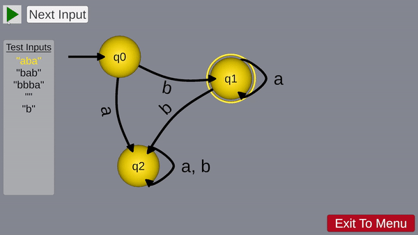

# DFA Animator
## Final Project for my Theory of Computation Course
### Play the web version at https://calicospartan.itch.io/dfa-animator
### To Run the desktop version, open the DfaAnimator/Build folder and run the DfaAnimator.exe file.

For my final project in my Theory of Computation Course, I built a Deterministic Finite Automata (DFA) Animator. I built this app using Unity. The app reads in a JSON representation of a DFA and creates an interactable DFA from that. In the web version of the app, you must type out a DFA representation (though an example is typed out for you by default).

